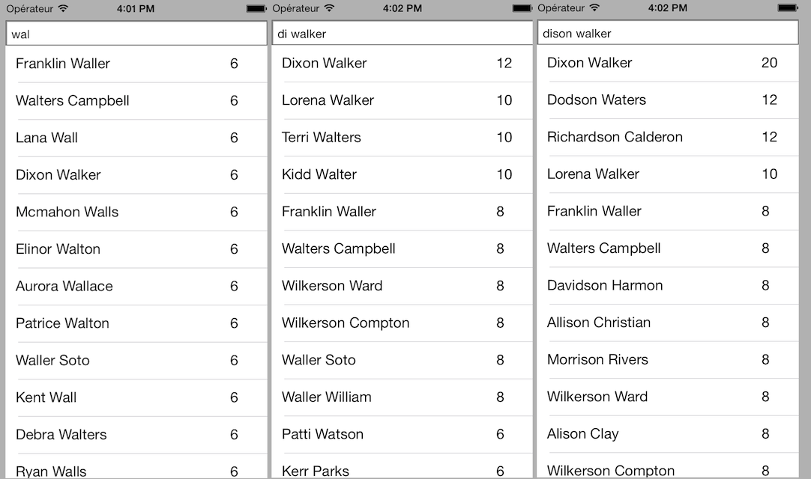

[](http://twitter.com/leverdeterre)
[](https://github.com/leverdeterre/PermissiveResearch/blob/master/LICENCE)
[](https://github.com/leverdeterre/PermissiveResearch)

PermissiveResearch
==================

An iOS search engine that allows mistakes in the searched element in huge data.
Many developpers would have executed a fectch request on a CoreData database or a predicate to filter on a NSArray.



PermissiveResearch is a alternative to simplify the search step.
Advantages : 
- No more problems with CoreData (context/thread),
- Performances,
- 100% resusable for each projects that need to perform analysis in huge data,
- Search algorithm are easy customizable,
- 3 algorithms already implemented, 

### Performances (on iphone4, searchig in 5000 objects 4 properties)

|  Type of search  | time (ms) | data structure | 
| ------------- |:-------------:| -------------| 
|  Exact search  | 200 | Using predicates      |
|  Exact search  | 2800 | Using PermissiveResearch (ExactScoringOperation*)   |
|  Exact search  | 100 | Using PermissiveResearch (HeuristicScoringOperation*)  |
|  Exact search  | 700 | Using PermissiveResearch (HeurexactScoringOperation*)  |
|  Tolerated search  | impossible.. | Using predicates  |
|  Tolerated search  | 2800 | Using PermissiveResearch (ExactScoringOperation*)   |
|  Tolerated search  | 100 | Using PermissiveResearch (HeuristicScoringOperation*)  |
|  Tolerated search  | 700 | Using PermissiveResearch (HeurexactScoringOperation*)  |

* ExactScoringOperation : Make a complex and total analysis,
* HeuristicScoringOperation : Scan using fragments (default size 3),
* HeurexactScoringOperation : Scan using fragments (default size 3), then make a complex and total analysis of the best pre-selected objects.

### Algorithms
It's a custom implementation of the [Smith-Waterman algorithm][1].
The purpose of the algorithm is to obtain the optimum local alignment.
A similarity matrix is use to tolerate errors.
[1]: http://en.wikipedia.org/wiki/Smith–Waterman_algorithm

### Shared instance
```objective-c
[[PermissiveResearchDatabase sharedDatabase] setDatasource:self];
```

### Datasource methods to fill your search database
```objective-c
-(void)rebuildDatabase
```

```objective-c
- (void)addObject:(id)obj forKey:(NSString *)key;
- (void)addObjects:(NSArray *)obj forKey:(NSString *)key;
- (void)addObjects:(NSArray *)objs forKeys:(NSArray *)keys;
- (void)addObjects:(NSArray *)objs forKeyPaths:(NSArray *)KeyPaths;

- (void)addManagedObject:(NSManagedObject *)obj forKey:(NSString *)key;
- (void)addManagedObjects:(NSArray *)objs forKey:(NSString *)key;
- (void)addManagedObjects:(NSArray *)objs forKeys:(NSArray *)keys;
- (void)addManagedObjects:(NSArray *)objs forKeyPaths:(NSArray *)KeyPaths;
```

Example :

```objective-c
///PermissiveResearchDatabase datasource
-(void)rebuildDatabase
{
    NSString *jsonPath = [[NSBundle mainBundle] pathForResource:@"data5000"
                                                         ofType:@"json"];
    NSData *data = [NSData dataWithContentsOfFile:jsonPath];
    NSError *error = nil;
    id json = [NSJSONSerialization JSONObjectWithData:data
                                              options:kNilOptions
                                                error:&error];
    
    [[PermissiveResearchDatabase sharedDatabase] addObjects:json forKeyPaths:@[@"name",@"gender",@"company",@"email"]];
    self.searchedList = json;
}
```

### Datasource method to customize scoring methods
```objective-c
-(NSInteger)customCostForEvent:(ScoringEvent)event
```

Example (default values) : 
```objective-c
-(NSInteger)customCostForEvent:(ScoringEvent)event
{
    switch (event) {
        case ScoringEventPerfectMatch:
            return 2;
            break;
           
        case ScoringEventNotPerfectMatchKeyboardAnalyseHelp:
            return 1;
            break;
            
        case ScoringEventNotPerfectBecauseOfAccents:
            return 2;
            break;
            
        case ScoringEventLetterAddition:
            return -1;
            break;
            
        default:
            break;
    }
    
    return NSNotFound;
}
```


### Easy search operation using PermissiveResearch delegate
```objective-

[[PermissiveResearchDatabase sharedDatabase] setDelegate:self];
[[PermissiveResearchDatabase sharedDatabase] searchString:searchedString withOperation:ScoringOperationTypeExact];
    
#pragma mark PermissiveResearchDelegate

-(void)searchCompletedWithResults:(NSArray *)results
{
    dispatch_async(dispatch_get_main_queue(), ^{
        self.findedElements = results;
        [self.tableView reloadData];
    });
}
```

### Create your first search operation
```objective-

    [[ScoringOperationQueue mainQueue] cancelAllOperations]
    HeuristicScoringOperation *ope = [[HeuristicScoringOperation alloc] init];
    ope.searchedString = searchedString;
    
    SearchCompletionBlock block = ^(NSArray *results) {
        dispatch_async(dispatch_get_main_queue(), ^{
            self.findedElements = results;
            NSLog(@"finded elements %@", results);
        });
    };
    
    [ope setCustomCompletionBlock:block];
    [[ScoringOperationQueue mainQueue] addOperation:ope];

```

### Actualy 3 operations are available, usage depends on the performance you need. 
Algorithms complexities are very differents.
HeuristicScoringOperation < HeurexactScoringOperation << ExactScoringOperation

```objective-c
ExactScoringOperation
HeuristicScoringOperation
HeurexactScoringOperation
```

### TODO
- Tolerate keyboard errors, very proximal letters can be tolerate.


